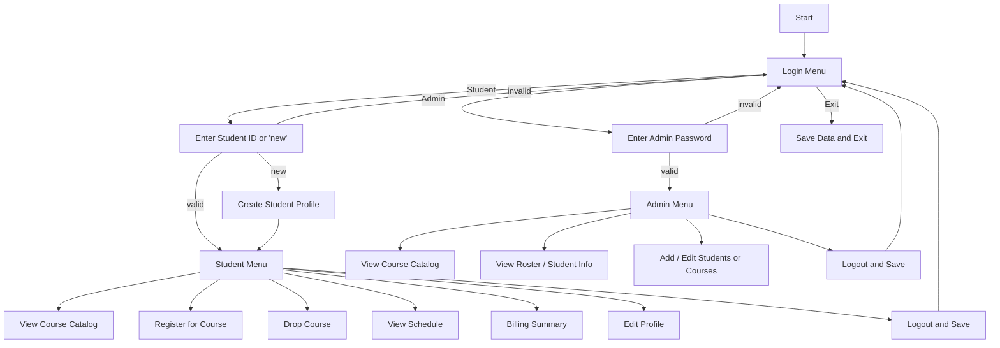

# unknownapp
Course Enrollment System reengineered from a Java CLI application.

## Overview
This repository contains:
- The original Java course enrollment CLI application under `src/`
- A new Python port of the student enrollment use case under `python/enrollment.py`
- Updated documentation with a use case diagram and Mermaid flowchart

## Use Case Diagram
```mermaid
usecaseDiagram
    actor Student
    actor Admin

    Student --> (Login as Student)
    Admin --> (Login as Admin)

    (Login as Student) --> (View Course Catalog)
    (Login as Student) --> (Register for a Course)
    (Login as Student) --> (Drop a Course)
    (Login as Student) --> (View My Schedule)
    (Login as Student) --> (Billing Summary)
    (Login as Student) --> (Edit My Profile)

    (Login as Admin) --> (View Course Catalog)
    (Login as Admin) --> (View Class Roster)
    (Login as Admin) --> (View All Students)
    (Login as Admin) --> (Add New Student)
    (Login as Admin) --> (Edit Student Profile)
    (Login as Admin) --> (Add New Course)
    (Login as Admin) --> (Edit Course)
    (Login as Admin) --> (View Student Schedule)
    (Login as Admin) --> (Billing Summary)
```

## Flowchart of the main workflow


## Python Port
The Python version is located in `python/enrollment.py` and implements the student enrollment use case with:
- student login / profile creation
- course catalog browsing
- registration and drop operations
- schedule display and tuition calculation
- JSON persistence under `python/data/`

### Run the Python version
```bash
python3 python/enrollment.py
```

## Prompts
- "Create a Python CLI version of the student enrollment use case from a Java course enrollment system. It should support student login, view catalog, register/drop courses, view schedule, billing summary, edit profile, and JSON persistence using only Python standard library."
